<h1 align="center">
    
</h1>
<h1 align="center">Design Document</h1>

<!-- #################################################### -->
<!-- 1. Introduction -->
<h2>1. Introduction</h2>

<h3>1.1 Project Overview</h3>

MuSpace is a music-based social media platform focused on connecting music fans with one another and allowing them to share their tastes with the world. Each MuSpace user will be provided with a personal feed to post about songs, albums, artists, and playlists that they are interested in. Users will be able to add friends on MuSpace and look at their detailed Spotify listening history. Users will also be able to view detailed statistics about their listening habits, such as listening time, favourite genres, favourite artists, and more.

<h3>1.2 References</h3>
<ul>
    <li><a href="https://ieeexplore.ieee.org/document/741934">IEEE Std 1016-1998</a></li>
    <li><a href="https://standards.ieee.org/standard/1016-1998.html">IEEE Recommended Practice for Software Design Descriptions.</a></li>
    <li><a href="https://standards.ieee.org/standard/830-1998.html">IEEE Computer Society, 1998</a></li>
</ul>

<!-- #################################################### -->
<!-- 2. Planned Implementation -->
<h2>2. Planned Implementation</h2>

<h3>2.1 Choice of Language</h3>

    Front-end: <a href="https://devdocs.io/html/" target="_blank">HTML</a>, <a href="https://developer.mozilla.org/en-US/docs/Web/JavaScript" target="_blank">Javascript</a>, <a href="https://developer.mozilla.org/en-US/docs/Web/CSS" target="_blank" >CSS</a>, <a href="" target="_blank" >ReactJS</a>  
    Back-end: <a href="https://developer.mozilla.org/en-US/docs/Web/JavaScript" target="_blank" >Javascript</a>  
    Database: <a  href="https://firebase.google.com/docs/firestore" target="_blank" >Firestore</a>, <a href="https://firebase.google.com/" target="_blank">Firebase</a>

<h3>2.2 Resources Referenced</h3>
<ul>
    <li>Icons Sourced from React Icons (<a href="https://react-icons.github.io/react-icons">https://react-icons.github.io/react-icons</a>)</li>
    <li>Figma Design Standards (<a href="https://blog.figma.com/material-design-figma-styles-98a7f0e2735e">https://blog.figma.com/material-design-figma-styles-98a7f0e2735e</a>)</li>
    <li>Spotify Web API for Music Data (<a href="https://developer.spotify.com/documentation/web-api/">https://developer.spotify.com/documentation/web-api/</a>)</li>
</ul>

<h3>2.3 Development Team</h3>
<table>
    <tr>
        <th style="text-align:center">Name</th>
        <th style="text-align:center">Standard/Template</th>
        <th style="text-align:center">Reviewed By</th>
    </tr>
    <tr>
        <td style="text-align:center">Requirements Document</td>
        <td style="text-align:center">Modified IEEE</td>
        <td rowspan="5" style="text-align:center">Entire Team</td>
    </tr>
    <tr>
        <td style="text-align:center">Project Management Document</td>
        <td style="text-align:center">Modified IEEE</td>
    </tr>
    <tr>
        <td style="text-align:center">Analysis Document</td>
        <td style="text-align:center">Modified IEEE</td>
    </tr>
    <tr>
        <td style="text-align:center">Design Document</td>
        <td style="text-align:center">Modified IEEE</td>
    </tr>
    <tr>
        <td style="text-align:center">User Document</td>
        <td style="text-align:center">Modified IEEE</td>
    </tr>
    <tr>
        <td style="text-align:center">Participation Record (Hours)</td>
        <td style="text-align:center">Self-documentation using internal Google Sheets file</td>
        <td style="text-align:center">Adrian</td>
    </tr>
    <tr>
        <td style="text-align:center">Source Code</td>
        <td style="text-align:center">Modified IEEE</td>
        <td style="text-align:center">All Developers</td>
    </tr>
</table>

<h3>2.4 Integration</h3>

The Spotify API/ Firebase login authenticity is being done by Nausher Rao. The verification and validation of his work will be completed by the remaining members.

<!-- #################################################### -->
<!-- 3. Decomposition Description -->
<h2>3. Decomposition Description</h2>

<h3>3.1.1 Framework Package Interactions</h3>

    <iframe allowfullscreen frameborder="0" style="width:960px; height:720px" src="https://lucid.app/documents/embeddedchart/3688a3f8-c8ae-43ee-8e08-371b9df8894c" id="t2iVjiOIkkqx"></iframe>

<h3>3.1.2 Model Class Diagram</h3>

    <iframe allowfullscreen frameborder="0" style="width:960px; height:720px" src="https://lucid.app/documents/embeddedchart/dd3c7144-fde2-4d4e-96a5-1df4cb1198b3" id="FQiV5yViSvix"></iframe>

<!-- #################################################### -->
<!-- 4. Interface Descriptions -->
<h2>4. Interface Descriptions</h2>

<h3>4.1 Colour Guidelines</h3>
<ul>
    <li>Colour Palette:</li>
    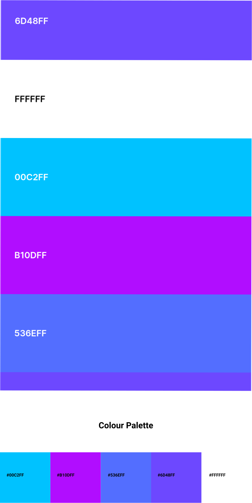 <!-- #################################################### -->
</ul>

<h3>4.2 Font Guidelines</h3>
<ul>
    <li>Roboto</li>
</ul>

<h3>4.3 App Icons</h3>
<ul>
    <li>MuSpace Logo (Full):</li>
     <!-- #################################################### -->
    <li>MuSpace Logo (Reduced):</li>
     <!-- #################################################### -->
</ul>

<h3>4.4 Module Interface</h3>

<h4>4.4.1 Sidebar (Constant in all Views aside from 4.4.3 and 4.4.4)</h4>

On every view, the sidebar allows for quick and easy navigation to any of the other views.

<table>
    <tr>
        <th style="text-align:center">Field</th>
        <th style="text-align:center">Type</th>
        <th style="text-align:center">Description</th>
    </tr>
    <tr>
        <td style="text-align:center">HomeView</td>
        <td style="text-align:center">Button</td>
        <td style="text-align:center">Links to HomePage</td>
    </tr>
    <tr>
        <td style="text-align:center">FriendsPageView</td>
        <td style="text-align:center">Button</td>
        <td style="text-align:center">Links to FriendsPage</td>
    </tr>
    <tr>
        <td style="text-align:center">MessagesView</td>
        <td style="text-align:center">Button</td>
        <td style="text-align:center">Links to MessagesPage</td>
    </tr>
    <tr>
        <td style="text-align:center">ProfileID</td>
        <td style="text-align:center">Button</td>
        <td style="text-align:center">Links to Profile View (Clicking the Profile Picture/ Username)</td>
    </tr>
    <tr>
        <td style="text-align:center">SettingsView</td>
        <td style="text-align:center">Button</td>
        <td style="text-align:center">Links to SettingsPage</td>
    </tr>
</table>

<h4>4.4.2 Searchbar (Constant in all Views aside from 4.4.3 and 4.4.4)</h4>
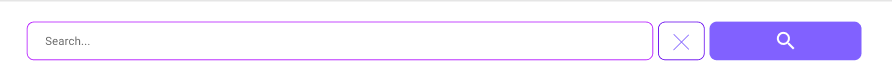

Search bar allows the user to find songs / albums / playlists etc, along with friends.

<table>
    <tr>
        <th style="text-align:center">Field</th>
        <th style="text-align:center">Type</th>
        <th style="text-align:center">Description</th>
    </tr>
    <tr>
        <th style="text-align:center">ClearButton</th>
        <th style="text-align:center">Button</th>
        <th style="text-align:center">Clears Search Field</th>
    </tr>
    <tr>
        <td style="text-align:center">SearchField</td>
        <td style="text-align:center">Text Field</td>
        <td style="text-align:center">Search Input</td>
    </tr>
    <tr>
        <td style="text-align:center">SearchButton</td>
        <td style="text-align:center">Button</td>
        <td style="text-align:center">Searches what was typed into the search field</td>
    </tr>
</table>

<h4>4.4.3 Login View</h4>
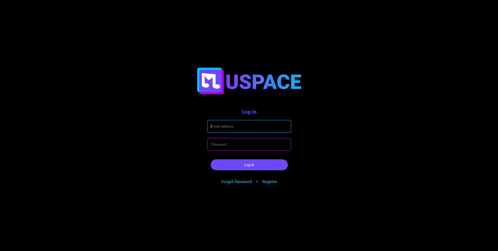

Login View allows users to enter their account credentials and login to their account.

<table>
    <tr>
        <th style="text-align:center">Field</th>
        <th style="text-align:center">Type</th>
        <th style="text-align:center">Description</th>
    </tr>
    <tr>
        <td style="text-align:center">MuSpaceLogo</td>
        <td style="text-align:center">Image</td>
        <td style="text-align:center">Application Logo</td>
    </tr>
    <tr>
        <td style="text-align:center">Log in</td>
        <td style="text-align:center">Label</td>
        <td style="text-align:center">Describes what page the user is on i.e Log in</td>
    </tr>
    <tr>
        <td style="text-align:center">Email or Username</td>
        <td style="text-align:center">Text Field</td>
        <td style="text-align:center">Asks for the email or name of the user.</td>
    </tr>
    <tr>
        <td style="text-align:center">Password</td>
        <td style="text-align:center">Text Field</td>
        <td style="text-align:center">Asks for the password to a user account associated with email/username.</td>
    </tr>
    <tr>
        <td style="text-align:center">Login-Button</td>
        <td style="text-align:center">Button</td>
        <td style="text-align:center">Signs into the account.</td>
    </tr>
    <tr>
        <td style="text-align:center">Forgot password-button</td>
        <td style="text-align:center">Button</td>
        <td style="text-align:center">Links to password recovery page.</td>
    </tr>
    <tr>
        <td style="text-align:center">Sign up-button</td>
        <td style="text-align:center">Button</td>
        <td style="text-align:center">Links to the RegisterView page in case the user does not have an account created.</td>
    </tr>
</table>

<h4>4.4.4 RegisterView</h4>
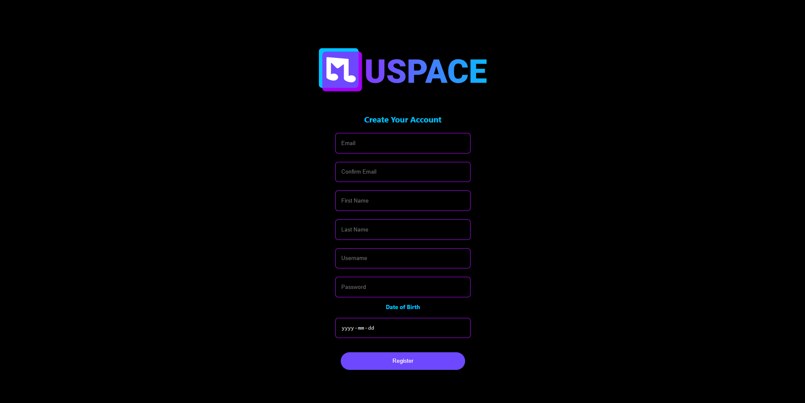
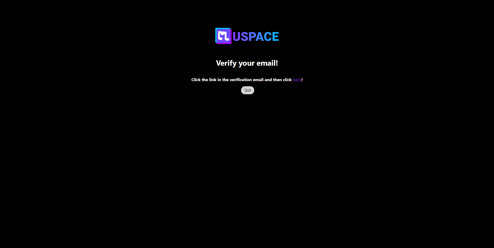

Register Page allows new users to register with MuSpace asking them for their credentials like Name, Email, Date of Birth, etc. creating an account for them with their desired available username and unique password.

<table>
    <tr>
        <th style="text-align:center">Field</th>
        <th style="text-align:center">Type</th>
        <th style="text-align:center">Description</th>
    </tr>
    <tr>
        <td style="text-align:center">MuSpaceLogo</td>
        <td style="text-align:center">Image</td>
        <td style="text-align:center">Application Logo</td>
    </tr>
    <tr>
        <td style="text-align:center">lblacc</td>
        <td style="text-align:center">Label</td>
        <td style="text-align:center">Tells the user about what the page is about i.e. creating your account.</td>
    </tr>
    <tr>
        <td style="text-align:center">Email</td>
        <td style="text-align:center">Text Field</td>
        <td style="text-align:center">Asks the user to input the desired email through which they would like to be associated with MuSpace.</td>
    </tr>
    <tr>
        <td style="text-align:center">Confirm email</td>
        <td style="text-align:center">Text Field</td>
        <td style="text-align:center">Asks the user to re-input their email to confirm the correct email.</td>
    </tr>
    <tr>
        <td style="text-align:center">First name</td>
        <td style="text-align:center">Text Field</td>
        <td style="text-align:center">Asks users to input their first name for application use.</td>
    </tr>
    <tr>
        <td style="text-align:center">Last name</td>
        <td style="text-align:center">Text Field</td>
        <td style="text-align:center">Asks users to input their Last name for application use.</td>
    </tr>
    <tr>
        <td style="text-align:center">Username</td>
        <td style="text-align:center">Text Field</td>
        <td style="text-align:center">The user is required to create a unique username, which is what he’ll use to login with MuSpace.</td>
    </tr>
    <tr>
        <td style="text-align:center">Password</td>
        <td style="text-align:center">Text Field</td>
        <td style="text-align:center">Password is a unique identification key that user will use with username to log into MuSpace and keep his account protected.</td>
    </tr>
    <tr>
        <td style="text-align:center">Date of birth</td>
        <td style="text-align:center">Text field / Drop-down Button</td>
        <td style="text-align:center">The user can either enter his date of birth or choose the date in the dropdown calendar.</td>
    </tr>
    <tr>
        <td style="text-align:center">Register</td>
        <td style="text-align:center">Button</td>
        <td style="text-align:center">This button takes the user to the next page,i.e. The check-email page from where the user can authorize spotify and start using Muspace.</td>
    </tr>
</table>

<h4>4.4.5 Home View</h4>
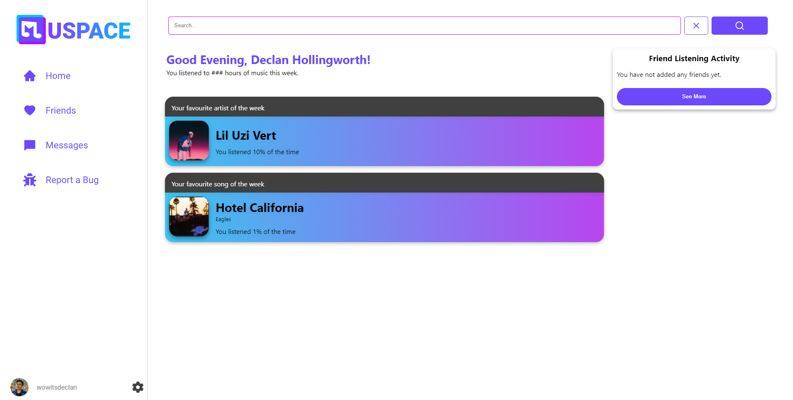
<table>
    <tr>
        <th style="text-align:center">Field</th>
        <th style="text-align:center">Type</th>
        <th style="text-align:center">Description</th>
    </tr>
    <tr>
        <td style="text-align:center">HomeButton</td>
        <td style="text-align:center">Button</td>
        <td style="text-align:center">This button takes you to home page</td>
    </tr>
    <tr>
        <td style="text-align:center">GreetingLBL</td>
        <td style="text-align:center">Label</td>
        <td style="text-align:center">This is just a greeting that shows up when the user logs in and goes to the home page.</td>
    </tr>
    <tr>
        <td style="text-align:center">FriendsButton</td>
        <td style="text-align:center">Button</td>
        <td style="text-align:center">This button takes you to the friend’s page where you can view friends’ profiles and music statistics.</td>
    </tr>
    <tr>
        <td style="text-align:center">MessagesButton</td>
        <td style="text-align:center">Button</td>
        <td style="text-align:center">This button takes you to the messaging page where you can message and talk to other users of the app.</td>
    </tr>
    <tr>
        <td style="text-align:center">Total Listening Time</td>
        <td style="text-align:center">Label</td>
        <td style="text-align:center">Displays total time spent listening to music since account creation</td>
    </tr>
    <tr>
        <td style="text-align:center">Album Cover</td>
        <td style="text-align:center">Button</td>
        <td style="text-align:center">This is located in your friend’s section, every time you click on it it takes you to the album cover your friend was listening to.</td>
    </tr>
    <tr>
        <td style="text-align:center">Username</td>
        <td style="text-align:center">Button</td>
        <td style="text-align:center">This is located in your friend’s section, every time you click on it it takes you to the friend’s profile with that username.</td>
    </tr>
    <tr>
        <td style="text-align:center">Favartistlbl</td>
        <td style="text-align:center">Label</td>
        <td style="text-align:center">Displays the most played artist of the week by the user</td>
    </tr>
    <tr>
        <td style="text-align:center">Favsonglbl</td>
        <td style="text-align:center">Label</td>
        <td style="text-align:center">Displays the most played song of the week</td>
    </tr>
    <tr>
        <td style="text-align:ceButton</td>
        <td style="text-align:center">Button</td>
        <td style="text-align:center">Links user to the settings page</td>
    </tr>
    <tr>
        <td style="text-align:center">ProfileButton</td>
        <td style="text-align:center">Button</td>
        <td style="text-align:center">Links user to their profile</td>
    </tr>
    <tr>
        <td style="text-align:center">SeeMoreButton</td>
        <td style="text-align:center">Button</td>
        <td style="text-align:center">Lets the user view more friends' listening activity.</td>
    </tr>
</table>

<h4>4.4.6 Message View</h4>
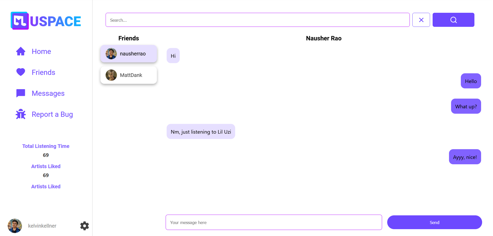

The Messages page is to allows users to communicate with their friends on the app.

<table>
    <tr>
        <th style="text-align:center">Field</th>
        <th style="text-align:center">Type</th>
        <th style="text-align:center">Description</th>
    </tr>
    <tr>
        <td style="text-align:center">PickFriend</td>
        <td style="text-align:center">Button</td>
        <td style="text-align:center">Changes which friend user is talking to</td>
    </tr>
    <tr>
        <td style="text-align:center">TypeMessage</td>
        <td style="text-align:center">Text Field</td>
        <td style="text-align:center">User inputs the message they want to send to the user</td>
    </tr>
    <tr>
        <td style="text-align:center">SendButton</td>
        <td style="text-align:center">Button</td>
        <td style="text-align:center">Sends selected message to the database (then the user)</td>
    </tr>
    <tr>
        <td style="text-align:center">FriendScroll</td>
        <td style="text-align:center">Scroll Bar</td>
        <td style="text-align:center">Allows the user to scroll through a friends list</td>
    </tr>
    <tr>
        <td style="text-align:center">UserID</td>
        <td style="text-align:center">Label</td>
        <td style="text-align:center">Displays friend’s Username & Picture</td>
    </tr>
</table>

<h4>4.4.7 Settings View</h4>
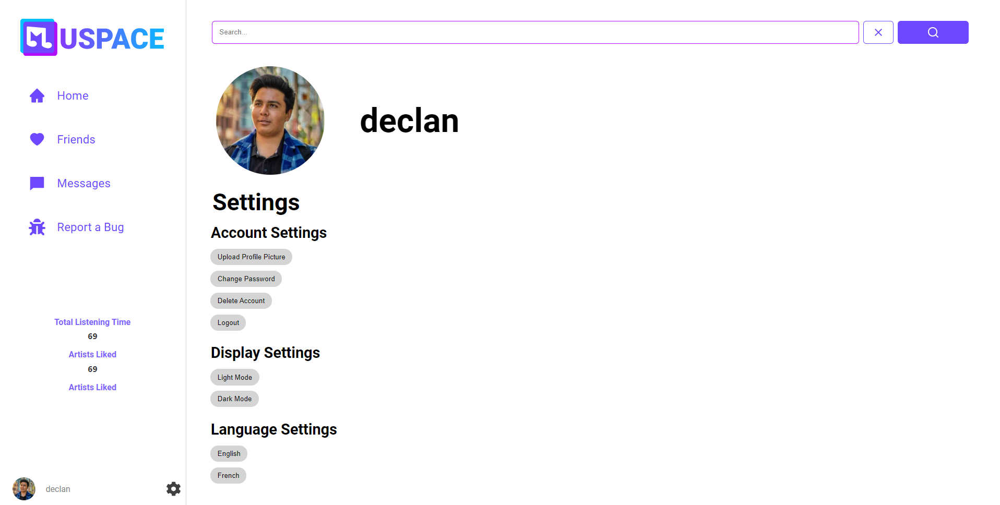

The View where a user can toggle between different settings options.

<table>
    <tr>
        <th style="text-align:center">Field</th>
        <th style="text-align:center">Type</th>
        <th style="text-align:center">Description</th>
    </tr>
    <tr>
        <td style="text-align:center">UserID</td>
        <td style="text-align:center">Label</td>
        <td style="text-align:center">Label displays user profile name</td>
    </tr>
    <tr>
        <td style="text-align:center">Upload</td>
        <td style="text-align:center">Button</td>
        <td style="text-align:center">User uploads new profile picture</td>
    </tr>
    <tr>
        <td style="text-align:center">ChangePassword</td>
        <td style="text-align:center">Button</td>
        <td style="text-align:center">User changes password</td>
    </tr>
    <tr>
        <td style="text-align:center">DeleteAccount</td>
        <td style="text-align:center">Button</td>
        <td style="text-align:center">Deletes the user’s profile</td>
    </tr>
    <tr>
        <td style="text-align:center">Logout</td>
        <td style="text-align:center">Button</td>
        <td style="text-align:center">Logs the user out of MuSpace</td>
    </tr>
    <tr>
        <td style="text-align:center">LanguageEnglish</td>
        <td style="text-align:center">Button</td>
        <td style="text-align:center">Changes the language to English</td>
    </tr>
    <tr>
        <td style="text-align:center">LanguageFrench</td>
        <td style="text-align:center">Button</td>
        <td style="text-align:center">Changes the language to French</td>
    </tr>
    <tr>
        <td style="text-align:center">LightMode</td>
        <td style="text-align:center">Button</td>
        <td style="text-align:center">Changes the UI to Light Mode</td>
    </tr>
    <tr>
        <td style="text-align:center">DarkMode</td>
        <td style="text-align:center">Button</td>
        <td style="text-align:center">Changes the UI to Dark Mode</td>
    </tr>
</table>

<h4>4.4.8 Notification View</h4>
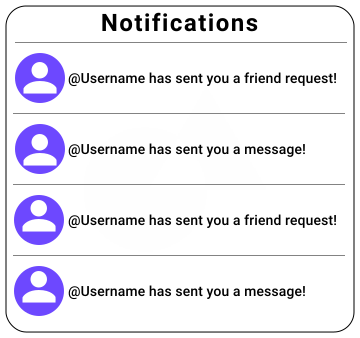

A View where the user can view all of their account notifications.

<table>
    <tr>
        <th style="text-align:center">Field</th>
        <th style="text-align:center">Type</th>
        <th style="text-align:center">Description</th>
    </tr>
    <tr>
        <td style="text-align:center">NotificationMessage</td>
        <td style="text-align:center">Label/Button</td>
        <td style="text-align:center">links to user’s profile or to notification content</td>
    </tr>
</table>

<h4>4.4.9 Profile View</h4>
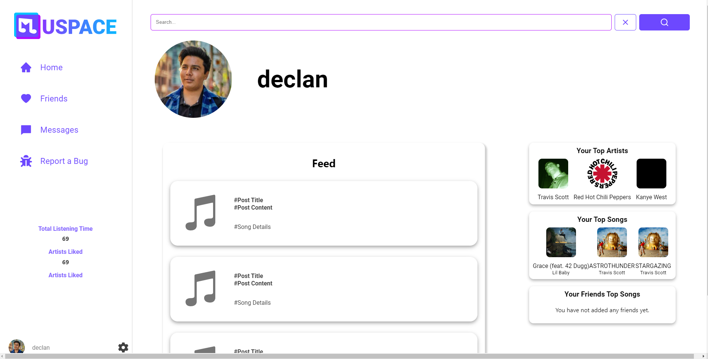

<table>
    <tr>
        <th style="text-align:center">Field</th>
        <th style="text-align:center">Type</th>
        <th style="text-align:center">Description</th>
    </tr>
    <tr>
        <td style="text-align:center">Feed (not yet implemented)</td>
        <td style="text-align:center">Label</td>
        <td style="text-align:center">Feed section title, section dynamically displays latest feed items</td>
    </tr>
    <tr>
        <td style="text-align:center">FeedItem (not yet implemented)</td>
        <td style="text-align:center">Button</td>
        <td style="text-align:center">Individual feed item displays post information</td>
    </tr>
    <tr>
        <td style="text-align:center">TopArtists</td>
        <td style="text-align:center">Label</td>
        <td style="text-align:center">Section displays user’s top artists</td>
    </tr>
    <tr>
        <td style="text-align:center">ArtistID</td>
        <td style="text-align:center">Label</td>
        <td style="text-align:center">Displays individual artists’</td>
    </tr>
    <tr>
        <td style="text-align:center">FriendsAlbums</td>
        <td style="text-align:center">Label</td>
        <td style="text-align:center">Section displays user’s friends’ top rated albums</td>
    </tr>
    <tr>
        <td style="text-align:center">AlbumID</td>
        <td style="text-align:center">Label</td>
        <td style="text-align:center">Displays individual album name</td>
    </tr>
    <tr>
        <td style="text-align:center">TopSongs</td>
        <td style="text-align:center">Label</td>
        <td style="text-align:center">Section displays user’s top rated songs</td>
    </tr>
</table>

<h4>4.4.10 FriendsView</h4>
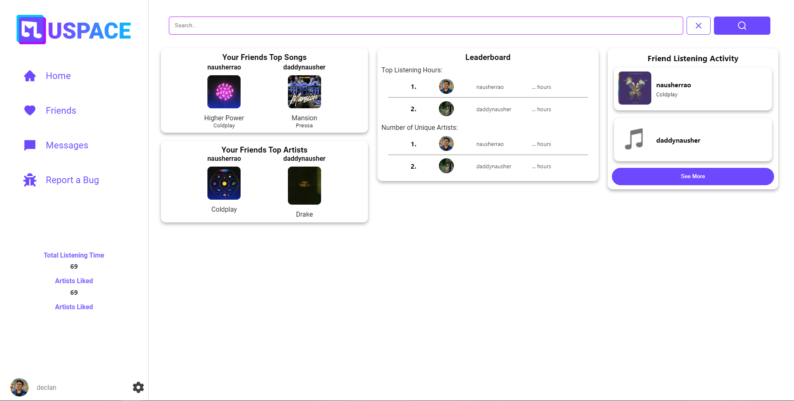

<table>
    <tr>
        <th style="text-align:center">Field</th>
        <th style="text-align:center">Type</th>
        <th style="text-align:center">Description</th>
    </tr>
    <tr>
        <td style="text-align:center">Your Friends Top Albums</td>
        <td style="text-align:center">Button</td>
        <td style="text-align:center">Displays your friend’s top album they are listening to</td>
    </tr>
    <tr>
        <td style="text-align:center">Your Friends Top Artists</td>
        <td style="text-align:center">Button</td>
        <td style="text-align:center">Displays your friends top artists they are listening to</td>
    </tr>
    <tr>
        <td style="text-align:center">Leaderboards</td>
        <td style="text-align:center">Button</td>
        <td style="text-align:center">A ranked chart that shows who out of your friends has the most listening hours and the number of unique artists they listen to</td>
    </tr>
    <tr>
        <td style="text-align:center">Friends Listening Activity</td>
        <td style="text-align:center">Button</td>
        <td style="text-align:center">A live feed that shows the song that your friend is listening to</td>
    </tr>
</table>
<!-- Data Dictionary -->
<h2>5. Data Dictionary</h2>
<iframe width="960px" height="720px" src="https://docs.google.com/spreadsheets/d/e/2PACX-1vRImyLXr4bhR2edzzLzhL9lxpPbIJsijbu4JbeLb7EWUWZLBmMctlpJkmVVrNEdqr9c54lwAu4RJiRB/pubhtml?gid=0&amp;single=true&amp;widget=true&amp;headers=false"></iframe>

<h2>6. Detailed Design</h2>
<h3>6.1 Module Detailed Design</h3>

RegisterPage()

<ol> 
    <li>Check if user is not logged in</li>
    <li>Display the register page, giving the option to create an account</li>
    <li>When a user tries to register, communicate with the Firebase database backend for account authentication. Also stores basic user information into the Firestore database.</li>
    <li>Else, redirect to the main page</li>
</ol>

RegisterForm()

<ol> 
    <li>Call RegisterField function to create fields</li>
    <li>Display fields:</li>
    <ol type="a">
        <li>Email</li>
        <li>Confirm Email</li>
        <li>First Name</li>
        <li>Last Name</li>
        <li>Username</li>
        <li>Password</li>
        <li>Date of Birth</li>
    </ol>
</ol>

RegisterField(text,type,placeholder)

<ol> 
    <li>Create Register field with attributes passed to the function</li>
</ol>

LoginPage()

<ol> 
    <li>Check if the user is not logged in</li>
    <li>Display login page, giving user option to log in, recover password, or sign up</li>
    <li>When the user tries to login, communicate with the Firebase database backend for account authentication</li>
    <li>Else, redirect to the main page.</li>
</ol>

LoginForm()

<ol> 
    <li>Call LoginField function to create fields</li>
    <li>Display fields for username/email and password input</li>
</ol>

LoginField(text,type,placeholder)

<ol> 
    <li>Create Login field with attributes passed to the function</li>
</ol>

Sidebar()

<ol> 
    <li>Lists all views; Home, Friends, and Messages</li>
    <li>Dynamically lists user stats; Total Listening Time, Artists Liked, Albums Liked</li>
    <li>Dynamically displays username and profile picture</li>
</ol>

SidebarButton()

<ol> 
    <li>Display field for texts on the sidebar</li>
</ol>

ListeningActivityCard()

<ol> 
    <li>Display username and what song and artist the user is listening to</li>
    <li>Option to bookmark the song being listened to</li>
</ol>

ProtectedRoute()

<ol> 
    <li>If the user is logged in</li>
    <li>Display sidebar and main page</li>
    <li>Else, if not logged in, redirect to the login page</li>
</ol>

PageRouter()

<ol> 
    <li>Display page paths:</li>
    <ol type="a">
        <li>Login</li>
        <li>Register</li>
        <li>Home</li>
    </ol>
    <li>Home is a protected path, so the user must be logged in to access it</li>
</ol>

AlbumCover(width)

<ol> 
    <li>Display album cover sized to parameter</li>
</ol>

UserButton()

<ol> 
    <li>Displays:</li>
    <ol type="a">
        <li>Username</li>
        <li>Profile Picture</li>
    </ol>
    <li>Links to the settings page</li>
</ol>

<!-- 6. Maintenance -->
<h2>7. Maintenance</h2>

<h3>7.1 Corrective</h3>

GitHub Issues Tracking tool is going to be used to organize issues that need to be resolved

<ol> 
    <li>Review: GitHub issues will be periodically monitored by the team to track new issues and their status</li>
    <li>Replication: Once a developer chooses to work on a specific issue they will attempt to recreate the issue inorder to diagnose the root cause of the issue.</li>
    <li>Correction: Once the issue’s root cause is identified, the developer will fix the issue in the code and update the Github repository with the fix and documented changes.</li>
</ol>

<h3>7.2 Preventative</h3>
<ul> 
    <li>Github actions</li>
</ul>

<h3>7.3 Perfective</h3>
<ul> 
    <li>Time is a major factor in what we as a group can accomplish, however after the completion of this project, some ideas on a shortlist to implement are</li>
    <ol> 
        <li><b>Matching Algorithm: </b>(To match with other users, you may not know)</li>
        <li><b>Listening Rooms:</b> where you can listen with your friends</li>
        <li><b>Chat Bot:</b> allowing you to ask questions about songs</li>
        <li><b>I’m Feeling Lucky:</b> pick a random song from Spotify and maybe you will like it</li>
        <li><b>Memories:</b> songs/ albums/ artists you haven't listened to in a while</li>
        <li><b>Global Leaderboards:</b> Leaderboards, but you know global</li>
        <li><b>Themes:</b> Allows the user to choose a theme for the app (light/ dark mode)</li>
        <li><b>Language:</b> Allows the user to change the language of the app</li>
    </ol>
</ul>

<h3>7.4 Adaptive</h3>
<ul>
    <li>As the Spotify API is updated, we will adapt to the changes and update accordingly</li>
</ul>

<!-- 8. Maintenance -->
<h2>8. Extra Details</h2>

<h3>Version History:</h3>
<ul>
    <li>Version 0.1.0 [Sections 1-7 Created] Preliminary Document</li>
    <ul>
        <li>July 6th</li>
        <li>Members - Adrian</li>
    </ul>
    <li>Version 0.1.1 [Sections 1-7 Continued] </li>
    <ul>
        <li>July 6th </li>
        <li>Members - Adrian, Peju, Farzan, Armaan, Nish</li>
    </ul>
    <li>Version 1.0.0 [Sections 1-7, Finalizing and Publishing]</li>
    <ul>
        <li>July 15th</li>
        <li>Members - All members</li>
    </ul>
    <li>Version 1.0.1 [Sections 1-7, Update to Reflect Changes Made]</li>
    <ul>
        <li>July 30th</li>
        <li>Members - Jagveer, Jiten</li>
    </ul>
</ul>

<!-- Authored By: -->
<h3>Authored By:</h3>
<ul>
    <li>Ali, Farzan</li>
    <li>Alting-Mees, Adrian</li>
    <li>Aylani, Jiten</li>
    <li>Goldman, Jacob</li>
    <li>Hollingworth, Declan</li>
    <li>Kellner, Kelvin</li>
    <li>Maan, Gur Armaan</li>
    <li>Manimaran, Mathu</li>
    <li>Mazza, Robert</li>
    <li>Olowonefa, Peju</li>
    <li>Rao, Nausher</li>
    <li>Sangha, Jagveer</li>
    <li>Tewari, Nish</li>
    <li>Yasin, Daner</li>
</ul>

